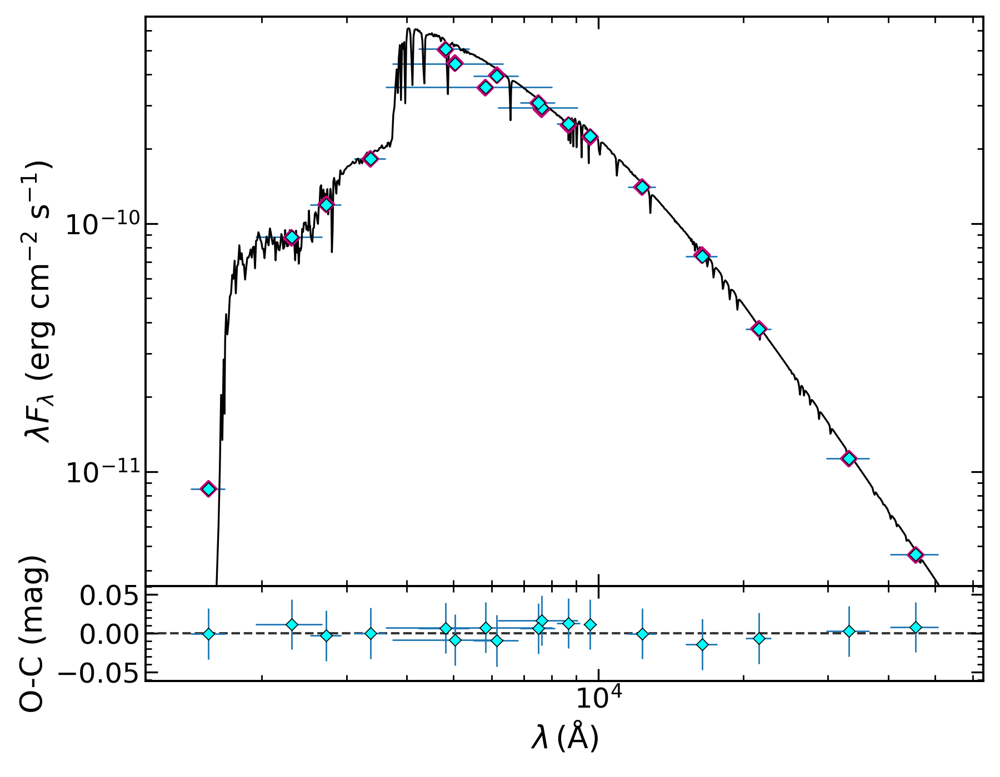
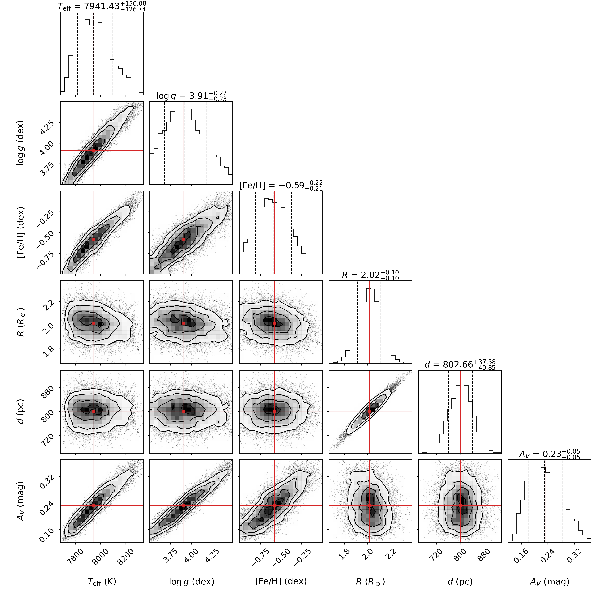
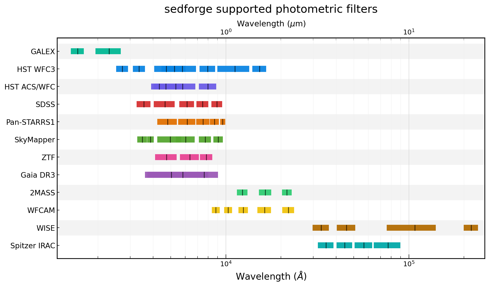
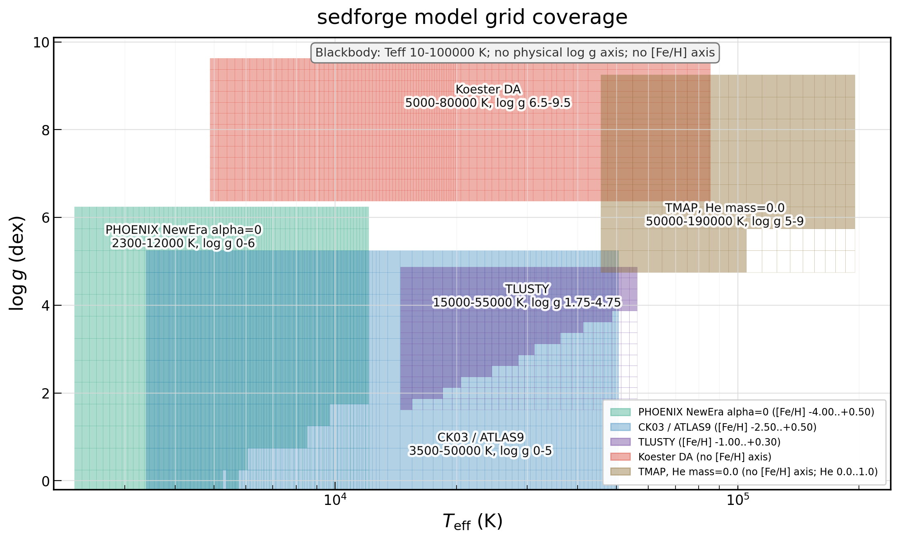

# sedforge

<p align="right">
  <a href="README.md"></a>
  <a href="README.zh-CN.md"></a>
</p>

sedforge 是一个用于恒星光度 SED（spectral energy distribution）拟合的Python 包。它以绝对通量为拟合对象，使用 MCMC 采样，支持单星、未分辨双星和未分辨三组分系统。

本项目是 [Speedyfit](https://github.com/vosjo/speedyfit) 的科研 fork。在原始 Speedyfit 的基础上，sedforge 对输入文件、模型网格、消光轴、绘图、catalog photometry helper 等做了较多调整，以适配下面描述的“星等输入优先”的工作流。

主要特性：

- 从简单的 `photband mag mag_err system` 光度表读取观测数据，并在内部转换为与模型网格一致的 band-averaged `Flambda`；
- `distance` 是以 parsec 为单位的物理拟合参数或固定参数；
- 当积分模型网格提供 `[Fe/H]` 轴时，可以把金属丰度作为真实网格轴拟合；
- 任意模型参数都可以通过 YAML 中的 `fixed:` 部分固定；
- 构建积分网格时，先在每个波长点应用消光，再通过滤光片响应曲线积分；
- 内置滤光片响应曲线来自
  [SVO Filter Profile Service](https://svo2.cab.inta-csic.es/theory/fps/)，
  并在 `filter_info.dat` 中记录 photon/energy response convention；
- 默认消光律为 `WC2019`，默认 `case1=1`。

> [!IMPORTANT]
> **不要把宽波段星等按固定有效波长换算成单色 flux density 后输入。**
> 宽波段的源依赖有效波长会随 SED 谱型和消光而变化。sedforge 因此推荐保留
> catalog 原生的 `mag`、`mag_err` 和 `system`：程序会用同一条完整 filter
> response 分别积分 AB/Vega zero point 和每个模型 SED，再拟合响应加权的
> band-averaged `Flambda`。在标准积分网格 likelihood 中，`eff_wave` 只作为
> 绘图和滤光片元数据，而不是模型取值的波长。只有已经按照下文约定计算为响应
> 加权 band-averaged `Flambda` 的通量，才适合作为直接 flux 输入。

本 fork 继承原 Speedyfit 的 GPLv3 license。公开发布或再分发时，请保留
GPLv3 license 和原始 attribution。

## 安装

sedforge 需要 Python 3.9 或更新版本。先 clone GitHub 仓库，进入仓库根目录，
再安装 package：

```bash
git clone https://github.com/pjchen3/sedforge.git
cd sedforge
python -m pip install .
```

开发模式安装，包括测试和构建工具：

```bash
python -m pip install -e ".[dev]"
```

可选依赖被放在 extras 中，避免把非核心依赖装进默认环境。下面的命令都应在
同一个仓库根目录下运行，只在需要对应功能时安装：

```bash
python -m pip install ".[photometry]"  # 使用 astroquery 下载 VizieR photometry
python -m pip install ".[svo]"         # 更新 SVO 滤光片曲线的辅助脚本
python -m pip install ".[hdf5]"        # HDF5 模型网格支持
```

代码仓库不包含大型模型网格。预构建的模型网格文件已发布在 Zenodo：
[doi:10.5281/zenodo.20520723](https://doi.org/10.5281/zenodo.20520723)。
如果只运行下面 `ck_all` 的 Quick Start，至少需要下载 integrated-grid archive。
如果希望生成带连续模型光谱的 SED 图，还需要下载 spectral-cache archive。
当前 v2026.06.03 data release 包含旧版 `ck03_cepheid_rv` HDF5 网格。
sedforge 0.3.0 也支持完整的 `ck03_rv` 和 `newera_alpha0_rv`，但这两个文件尚未
包含在该 Zenodo 记录中；用户需要使用包内脚本自行生成，或等待后续 data release。
使用任何 HDF5 网格都需要安装 `hdf5` extra。

把需要的 archive 解压到同一个上级目录中，让它们合并成同一个 `sed_models/`
目录。模型网格目录通过环境变量 `SEDFORGE_MODELS` 指定：

```bash
export SEDFORGE_MODELS=/path/to/sed_models
```

这个目录应包含 `grid_description.yaml` 以及其中引用的模型文件。推荐的本地布局：

```text
sed_models/
  grid_description.yaml
  raw/              # 原始模型光谱
  integrated/       # 通过滤光片积分后的拟合网格
  ck03_rv/          # 可选：带显式 Rv 轴的 HDF5 网格
  newera_alpha0_rv/ # 可选：带显式 Rv 轴的 HDF5 网格
  spectral_cache/   # 只用于绘图的连续光谱缓存
```

## 快速开始

这个示例使用目标名 `my_target` 和模型网格 `ck_all`。

先在当前工作目录下创建一个名为 `my_target.phot` 的星等光度文件。这个文件必须
包含以下列：

```text
photband  mag    mag_err  system
GAIA3E_G  12.30  0.01     vega
PS1_g     18.42  0.02     ab
2MASS_Ks  10.10  0.02     vega
```

`photband` 需要匹配包内的滤光片响应曲线名称，例如 `GAIA3E_G`、
`2MASS_Ks`、`WISE_RSR_W1`、`HST_WFC3_F814W`，或
`sedforge/transmission_curves` 中的其他波段。

为目标 `my_target` 和网格 `ck_all` 生成一个起始 setup 文件：

```bash
sedforge setup my_target -grid ck_all
```

这个命令会生成 `my_target_setup_ck_all.yaml`。默认情况下，这个 setup 文件会在
同一目录下寻找输入光度文件 `my_target.phot`；如果想用其他文件名或路径，需要
编辑生成的 YAML。

然后用生成的 setup 文件运行拟合：

```bash
sedforge fit my_target_setup_ck_all.yaml --noplot
```

这里的 `--noplot` 会跳过 SED 图和 corner plot，因此只下载 integrated-grid
archive 也可以运行这个快速示例。如果已经解压了 spectral-cache archive，可以
去掉 `--noplot` 来生成图。输出通常包括：

- 一行 CSV 拟合结果摘要；
- FITS 格式的 accepted MCMC samples；
- 启用绘图时，还会生成 SED 拟合图和 posterior corner plot。

下面是一个 synthetic `ck_all` recovery 的示例输出。第一张图是 SED 拟合结果，
第二张图是对应的 MCMC posterior corner plot。

<p align="center">
  
</p>

<p align="center">
  
</p>

## 光度输入格式

推荐输入格式为星等表：

```text
photband  mag    mag_err  system
GAIA3E_G  12.30  0.01     vega
PS1_g     18.42  0.02     ab
2MASS_Ks  10.10  0.02     vega
```

sedforge 会使用与模型网格相同的 SVO 响应曲线，把星等转换为
band-averaged `Flambda`。`sedforge photometry` 生成的文件会保留内部转换后的
flux 列，便于检查：

```text
photband  mag    mag_err  system  mag_type  mag_zp_offset  flux       flux_err
GAIA3E_G  12.30  0.01     vega    pogson    0.00           1.23e-13  1.13e-15
```

如果同一个表里同时有 magnitude 和 flux 列，fitter 会优先使用 magnitude
列并重新计算 flux。高级输入仍可使用 `photband flux flux_err`，但这些 flux
必须已经是 band-averaged `erg/s/cm2/Angstrom`。

常见内置滤光片的默认星等系统：

- Vega: `GAIA3E`, `2MASS`, `WISE_RSR`, `SPITZER_IRAC`, `WFCAM`
- AB: `GALEX`, `PS1`, `SDSS`, `SkyMapper`, `ZTF`

HST 滤光片没有默认系统，因为同一 passband 可能用 VegaMag、ABMag 或 STMag
报告。HST photometry 应显式提供 `system: vega` 或 `system: ab`。当前不支持
STMag 输入。

下图概括了当前内置滤光片按 instrument family 的波长覆盖。实际输入时仍应使用
`sedforge/transmission_curves` 中的精确 `photband` 名称；图中展示的是按
instrument 汇总后的覆盖范围。



SDSS catalog magnitudes 是 luptitudes/asinh magnitudes，因此 sedforge 不用
高信噪比 Pogson 近似直接转换。对于 `SDSS_u/g/r/i/z`，代码使用 SDSS softening
parameters，并反解 asinh magnitude。若你的 SDSS 数据已经转成普通 AB/Pogson
星等，请在表中显式设置 `mag_type` 为 `pogson`，并设置 `mag_zp_offset` 为
`0.0`。

可以在 setup 文件中使用 `photband_include` 或 `photband_exclude` 选择波段。
选择器支持 family prefix，例如 `GAIA3E` 会匹配 `GAIA3E_G`、`GAIA3E_BP` 和
`GAIA3E_RP`。

## 从 VizieR 下载星等

安装 photometry extra 后，可以用坐标或 Gaia DR3 source id 从配置好的
VizieR catalogs 生成光度表。默认配置包括：

- Gaia DR3: `I/355/gaiadr3`
- 2MASS: `II/246/out`
- AllWISE: `II/328/allwise`
- Pan-STARRS1: `II/349/ps1`
- SDSS DR12: `V/147/sdss12`
- GLIMPSE: `II/293/glimpse`
- SkyMapper DR2: `II/379`
- GALEX AIS: `II/312/ais`

使用 Gaia DR3 source id：

```bash
sedforge photometry \
  --gaia-id 1234567890123456789 \
  --output my_target.phot \
  --metadata-output my_target_catalogs.dat
```

使用坐标：

```bash
sedforge photometry \
  --ra 10.6847083 --dec 41.26875 \
  --output my_target.phot
```

可通过 `--catalog-config my_catalogs.yaml` 覆盖内置 catalog 配置。

## 模型网格

积分模型网格是 FITS table。必要列包括模型轴，例如 `teff`、`logg`、`av`，
可选 `feh`，以及每个滤光片的一列 flux。`Labs` 列存储拟合输出中使用的
bolometric luminosity 信息。

当前 sedforge 的模型配置支持以下光谱模型 family。大型网格文件不会提交到
Git 仓库中，应从数据发布页面下载，或由用户在本地自行生成。

- Castelli & Kurucz 2003：包括 `ckm25`、`ckm20`、`ckm15`、`ckm10`、
  `ckm05`、`ckp00`、`ckp02`、`ckp05`，以及合并后的 `ck_all`
  金属丰度 stack；HDF5 网格 `ck03_rv` 带显式 `Rv` 和 `Av` 轴。
- TLUSTY/SYNSPEC 热星模型：包括 `tlusty00`、`tlusty01`、`tlusty02`、
  `tlusty05`、`tlusty10`、`tlusty20` 和 `tlusty_all`；非零金属丰度
  stack 中使用 `feh = log10(Z/Zsun)`。
- PHOENIX NewEra V3 LowRes alpha=0 光谱：对应 `newera_alpha0`，带真实
  `[Fe/H]` 网格轴；HDF5 网格 `newera_alpha0_rv` 还带显式 `Rv` 和 `Av`
  轴。
- Koester DA 白矮星光谱：对应 `koester2`。
- TMAP H+He 光谱：对应 `tmap_he000` 到 `tmap_he100`，每个网格使用固定
  helium mass fraction。
- Disc-integrated blackbody 网格：对应 `blackbody`，用于简单连续谱组分。

下图概括了当前预构建模型网格在有效温度和表面重力空间中的覆盖范围。图中只
标出有效的非零光谱；源 FITS 文件中的 zero-flux placeholder 光谱已排除。
精确的网格轴、金属丰度覆盖和文件路径仍以 `grid_description.yaml` 以及发布的
网格文件为准。



sedforge 并不只限于这些模型。用户可以根据自己的科学目标，把新的 atmosphere
或 spectrum library 用同一套滤光片响应曲线和消光律进行卷积，然后把生成的
积分网格加入 `grid_description.yaml`。自定义积分网格应遵守与内置网格相同的
格式约定：包含 `teff`、`logg`、`av` 等模型轴列以及可选物理参数轴；每个
滤光片一列 band-averaged `Flambda`；如果需要输出 luminosity，则提供 `Labs`
列；如果希望绘图显示连续光谱，则提供可选的 `spectral_cache` FITS 文件，其中
波长单位为 Angstrom，通量单位为 `erg/s/cm2/Angstrom`。如果新的网格名称没有
覆盖在当前内置 setup 默认范围里，应在 setup 文件中显式给出合适的参数范围，
或在运行拟合前扩展包内默认设置。

模型目录由 `grid_description.yaml` 描述。一个固定金属丰度网格示例：

```yaml
ckp00:
  filename: ck03_p00
  raw_filename: raw/ck/ck03_p00
  feh: 0.0
  spectral_cache: spectral_cache/ck_all_plot_spectra.fits
  info: Castelli & Kurucz 2003, [Fe/H] = 0.0
```

一个金属丰度 stack 示例：

```yaml
ck_all:
  filename: ck_all
  integrated_subdir: integrated
  spectral_cache: spectral_cache/ck_all_plot_spectra.fits
  info: Combined Castelli & Kurucz metallicity stack
  members:
    - grid: ckm05
      feh: -0.5
    - grid: ckp00
      feh: 0.0
    - grid: ckp05
      feh: 0.5
```

如果 FITS 网格本身包含真实 `[Fe/H]` 列，可以声明：

```yaml
newera_alpha0:
  filename: newera_alpha0
  integrated_subdir: integrated
  spectral_cache: spectral_cache/newera_alpha0_plot_spectra.fits
  supports_feh: true
  info: PHOENIX NewEra alpha=0 integrated grid
```

## 绘图用原始光谱缓存

拟合使用积分网格，以保持速度和文件大小。SED 图中显示的连续模型光谱应放在
单独的 spectral cache 中。该 FITS 文件包含：

- `PARAMS`: 每个模型光谱一行，列如 `teff`、`logg`、`feh`、`he_mass`；
- `WAVE`: 公共波长网格，单位 Angstrom；
- `FLUX`: 二维 `(n_spectra, n_wave)` 数组，单位 `erg/s/cm2/Angstrom`。

fitter 会用 FITS memory mapping 打开这些文件，只读取绘图需要的最近模型光谱，
避免把整个光谱库一次性载入内存。

## 消光律与滤光片积分

积分网格生成时，sedforge 会先对每个模型光谱在每个波长点应用消光律，然后再
通过滤光片响应曲线积分。这避免了把消光近似成单一有效波长修正。

默认消光律为 WC2019，即 Wang & Chen (2019),
*The Optical to Mid-infrared Extinction Law Based on the APOGEE, Gaia DR2,
Pan-STARRS1, SDSS, APASS, 2MASS, and WISE Surveys*, ApJ, 877, 116,
doi:[10.3847/1538-4357/ab1c61](https://doi.org/10.3847/1538-4357/ab1c61)。

默认设置：

```yaml
reddening_law: WC2019
reddening_Rv: 3.1
reddening_case1: 1
```

对于普通 FITS 积分网格，`reddening_Rv` 是网格选择常数，不是 MCMC 采样参数。
不要在 `ck_all`、`newera_alpha0`、`tlusty_all`、`koester2` 或 `blackbody`
这类网格的 `pnames` 中放 `rv`。

HDF5 网格 `ck03_rv` 和 `newera_alpha0_rv` 有显式 `rv` 轴。此时应从 setup
中移除 `reddening_Rv`/`Rv`，并把 `rv` 作为拟合参数，或在 `fixed:` 中固定：

```yaml
grids: [ck03_rv]
pnames: [teff, logg, feh, rad, distance, av, rv]
limits:
  - [3500, 50000]     # teff, K
  - [0.0, 5.0]        # logg, dex
  - [-2.5, 0.5]       # [Fe/H], dex
  - [0.05, 500.0]     # radius, Rsun
  - [100, 100000]     # distance, pc
  - [0.0, 4.0]        # Av, mag
  - [2.0, 5.0]        # Rv
```

如果使用 `newera_alpha0_rv`，`rv` 的写法相同，但参数范围应换成 NewEra 的
覆盖范围，例如 `teff = 2300..12000 K`、`logg = 0..6`、`[Fe/H] = -2.5..0.5`。

内置滤光片曲线由 `filter_svo_map.dat` 和
[SVO Filter Profile Service](https://svo2.cab.inta-csic.es/theory/fps/) 生成。
`filter_info.dat` 记录 SVO id 和本地 `response_type`：photon response 在合成
photometry 中使用额外波长权重，energy response 不使用额外波长权重。SVO 的
WISE 和 Spitzer/IRAC 曲线是 energy responses。

## Setup 文件

一个 YAML setup 文件控制一次拟合。主要内容包括：

- target 和 photometry；
- 模型网格和消光律；
- 拟合参数和硬边界；
- 固定参数；
- 拟合参数的 Gaussian priors；
- MCMC sampler 设置；
- 输出文件和绘图设置。

`pnames` 和 `limits` 定义 MCMC 采样参数。`fixed` 定义不参与采样的固定参数。
所选网格需要的每个模型参数，都必须出现在 `pnames` 或 `fixed` 中。

固定 `[Fe/H]` 示例：

```yaml
fixed:
  feh: 0.0
```

不要用相同上下限来“固定”一个参数。`pnames` 里的参数必须有真实的非零拟合
范围；固定值统一放在 `fixed` 里。

`fixed` 是硬固定值，不参与采样。`priors` 是 posterior 中的 Gaussian priors，
参数仍然参与采样，因此每个 prior 都必须对应 `pnames` 中的一个名字：

```yaml
priors:
  distance: [1000.0, 50.0]
```

派生量如 `L`、`mass`、`q` 是输出或检查量，不是拟合参数，不能放进 `priors`。

setup 文件中的消光参数始终是 `av`，即以 magnitude 为单位的 `A(V)`。旧的
`ebv` / `E(B-V)` 参数会被拒绝。

## 单星示例

下面的 setup 拟合 `teff`、`logg`、`rad`、`distance` 和 `av`，同时固定
`[Fe/H]=0.0`：

```yaml
objectname: example_single
photometryfile: example_single.phot
photband_exclude: []

grids:
  - ck_all
reddening_law: WC2019
reddening_Rv: 3.1
reddening_case1: 1

pnames: [teff, logg, rad, distance, av]
limits:
  - [5000, 9000]      # teff, K
  - [3.0, 5.0]        # logg, dex
  - [0.1, 10.0]       # radius, Rsun
  - [100, 5000]       # distance, pc
  - [0.0, 3.1]        # Av, mag

fixed:
  feh: 0.0

priors: {}

nwalkers: 80
nsteps: 1000
nrelax: 300
a: 2
percentiles: [16, 50, 84]

resultfile: example_single_results.csv
datafile: example_single_samples.fits
plot1:
  type: sed_fit
  result: pc
  path: example_single_sed.png
plot2:
  type: distribution
  show_best: true
  path: example_single_corner.png
  parameters: [teff, logg, rad, distance, av]
```

运行：

```bash
sedforge fit example_single_setup.yaml --noplot
```

## 多组分拟合

双星 setup 每个组分使用一个网格。共享参数如 `distance`、`av` 和 `feh` 只需
提供一次；第二个组分的参数使用后缀 `2`。

示例：

```yaml
grids:
  - ck_all
  - ck_all

pnames: [teff, logg, rad, teff2, logg2, rad2, distance, av]
limits:
  - [8000, 16000]     # teff
  - [3.5, 5.0]        # logg
  - [0.5, 5.0]        # rad
  - [3500, 6500]      # teff2
  - [2.0, 4.5]        # logg2
  - [1.0, 20.0]       # rad2
  - [100, 5000]       # distance
  - [0.0, 1.55]       # Av

fixed:
  feh: 0.0
```

如果两个组分应使用不同金属丰度：

```yaml
fixed:
  feh: 0.0
  feh2: -0.5
```

三组分拟合同理：提供三个网格，并使用后缀 `3` 表示第三个组分的模型参数。
网格数量必须与组分数量一致。

## 性能、批处理与采样诊断

带显式 `Rv` 轴的 HDF5 网格通常远大于固定 `Rv` 的 FITS 网格。普通拟合默认使用
以下设置，在不改变精确 likelihood 的前提下控制内存：

```yaml
init_method: auto
hdf5_preload: false
hdf5_walker_cache: true
hdf5_auto_full_cache_max_gb: 2.0
vectorized_likelihood: true
```

对于单组分 HDF5 网格，`init_method: auto` 会选择 grid-aware walker 初始化：
搜索真实存在的 atmosphere/extinction 节点，解析求解 radius-distance 归一化，
再用完整 posterior 对候选点排序。如果快速种子明显不合理，默认启用的
`init_grid_rescue: true` 会执行无梯度全局救援搜索。平滑 FITS 网格仍可使用
`init_method: map`，但该方法不适用于分段、非矩形 HDF5 网格，因此会被拒绝。

HDF5 缓存只保存 setup 参数范围内真实存在的光谱。走出局部缓存的 proposal 会
自动回退到精确 HDF5 插值，所以缓存不会限制参数空间或改变 posterior。只有非
MCMC 代码也需要立即加载网格时，才建议设置 `hdf5_preload: true`。

拟合大量目标时，建议使用 CSV manifest 做 source-level 并行：

```bash
sedforge batch sources.csv --setup-template template.yaml --workers 8
```

manifest 可以包含 `setup_file` 列，也可以用各列覆盖 template；带点号的列名用于
修改嵌套 YAML 项：

```text
source_id,photometryfile,output_dir,priors.distance,fixed.feh
src001,phot/src001.phot,runs/src001,"[262.8, 10.0]",0.0
src002,phot/src002.phot,runs/src002,"[120.5, 5.0]",0.0
```

batch 默认每个目标使用一个 MCMC worker 且不绘图。同一种单组分网格的任务会在
fork 前预热所有目标参数范围和波段的并集，让兼容 worker 共享只读缓存。只在少量
诊断任务中使用 `--plots`；需要时可用 `--shared-grid-cache-max-gb` 调整共享缓存
上限。

重复运行 batch 时，可以复用持久 runtime cache：

```bash
sedforge batch sources.csv --setup-template template.yaml --workers 8 \
  --runtime-grid-cache-dir /path/to/sedforge-runtime-cache
```

同一路径也可通过 `SEDFORGE_RUNTIME_CACHE` 或 setup 中的
`runtime_grid_cache_dir` 设置。缓存标识包含源网格元数据、active limits、模型变量
和波段；过期、不完整或损坏的缓存会自动忽略。

burn-in 后的链会检查 rank-normalized/folded split R-hat、bulk/tail effective
sample size 和 walker acceptance fraction。诊断信息会写入结果 CSV，也可单独输出
为 YAML：

```yaml
convergence_rhat_threshold: 1.05
convergence_min_acceptance: 0.01
convergence_min_bulk_ess: 100
convergence_min_tail_ess: 100
convergence_action: warn
diagnosticsfile: target_mcmc_diagnostics.yaml
```

生产批处理可使用 `convergence_action: error` 拒绝未达到采样质量阈值的链。
posterior 宽度和边界占比等 identifiability 指标只用于报告，不会让拟合失败。

## 常用命令

创建起始 setup：

```bash
sedforge setup my_target -grid ck_all
```

运行拟合：

```bash
sedforge fit my_target_setup_ck_all.yaml --noplot
```

检查已安装模型网格：

```bash
sedforge checkgrids
sedforge checkgrids --bands
```

从 VizieR 下载星等光度文件：

```bash
sedforge photometry --ra 10.6847083 --dec 41.26875 \
  --output my_target.phot
```

运行测试：

```bash
python -m pytest
```

构建 source distribution 和 wheel：

```bash
python -m build
```

## 输出文件

典型输出包括：

- `resultfile`: 一行 CSV，包含 median 值、16th/84th percentile uncertainty，
  以及 `mcmc_status`、`mcmc_max_split_rhat` 等采样质量字段；
- `datafile`: FITS table 格式的 accepted MCMC samples；
- `diagnosticsfile`（可选）：包含收敛、初始化和网格缓存诊断的 YAML 文件；
- SED plot: 观测 flux 和最佳/percentile 模型 SED；
- corner plot: 采样参数的 posterior distributions。

corner plot 的常见参数标签包含物理单位，例如 `teff`、`logg`、`feh`、`rad`、
`distance` 和 `av`。

## License 与引用

sedforge 派生自 Joris Vos 的原始
[Speedyfit](https://github.com/vosjo/speedyfit) package，并保留 GPLv3 license。
完整 license 见 `LICENSE`。

如果在论文中使用 sedforge，请引用 `CITATION.cff` 中的软件条目。由于 sedforge
派生自 Speedyfit，也请引用 Speedyfit 仓库和相关论文：

- [Speedyfit](https://github.com/vosjo/speedyfit)，原始软件仓库；
- Vos et al. (2017), *The orbits of subdwarf-B + main-sequence binaries. III.
  The period-eccentricity distribution*, A&A, 605, A109,
  doi:[10.1051/0004-6361/201730958](https://doi.org/10.1051/0004-6361/201730958)；
- Vos et al. (2018), *Composite hot subdwarf binaries - I. The
  spectroscopically confirmed sdB sample*, MNRAS, 473, 693-709,
  doi:[10.1093/mnras/stx2198](https://doi.org/10.1093/mnras/stx2198)。

还应引用分析中实际使用的模型大气网格、滤光片响应曲线/catalogs 和消光律。
例如论文中应说明：

- 如果使用了预构建的 sedforge 模型网格 archive，请引用
  [doi:10.5281/zenodo.20520723](https://doi.org/10.5281/zenodo.20520723)；
- 模型 family 和 grid release，例如 Castelli & Kurucz、PHOENIX/NewEra、
  TLUSTY、Koester、TMAP 或 blackbody grids，并引用实际使用的每个光谱模型
  family 对应的原始论文或模型网格文档；
- 滤光片响应曲线来源，例如
  [SVO Filter Profile Service](https://svo2.cab.inta-csic.es/theory/fps/)，
  并按该服务的 acknowledgement 和 citation 说明引用；
- 查询的 photometry catalogs，例如 Gaia DR3、2MASS、AllWISE、PS1、SDSS、
  GLIMPSE、SkyMapper 或 GALEX；
- 消光律和参数，例如 `WC2019`、`Rv` 和 `case1`。对于内置 WC2019 law，请引用
  Wang & Chen (2019),
  doi:[10.3847/1538-4357/ab1c61](https://doi.org/10.3847/1538-4357/ab1c61)。

问题反馈、可复现示例或 release 相关问题，请在 GitHub 仓库中打开 issue。
